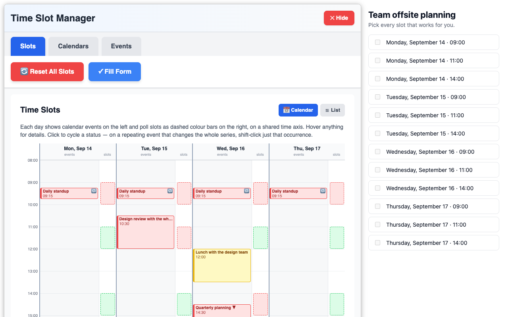
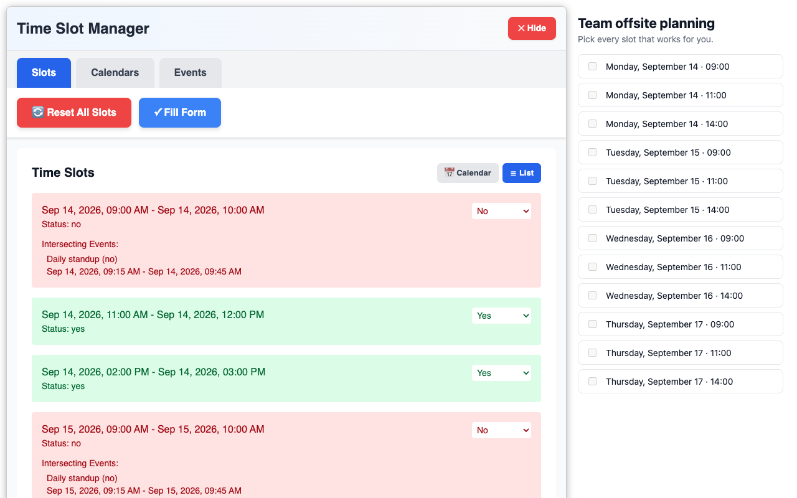
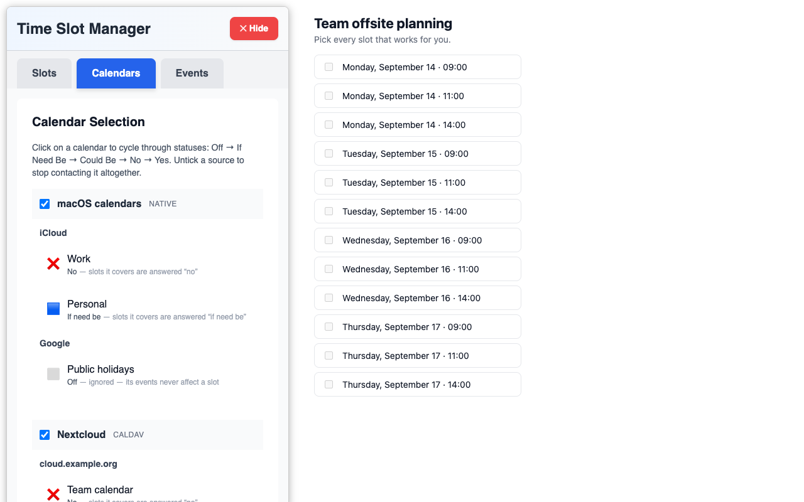

# No More Doodle

[**Install for Firefox**](https://addons.mozilla.org/firefox/addon/no-more-doodle-extension/) — Firefox 128 or later.

It works in Chrome and Chromium too, but there is no Web Store release: see
[How to install from source](#how-to-install-from-source).

<!--
	The section between the amo:start and amo:end markers is the source for the
	addons.mozilla.org listing description: helpers/amo-update.py reads it from
	here, so keep it a self-contained description of the extension.
-->
<!-- amo:start -->

No More Doodle fills in scheduling polls for you, using the events already in your calendar.

Open a poll, and the extension lays your calendar side by side with the poll's time slots: a calendar view on a shared time axis, and a list view spelling out exactly which events clash with each slot. Every slot gets a proposed answer, you adjust anything you disagree with, and one click fills the whole form.

Supported scheduling sites:

- [Doodle](https://doodle.com)
- [Evento](https://evento.renater.fr)
- [Framadate](https://framadate.org)
- [Timeful](https://timeful.app)
- [Rallly](https://app.rallly.co)

You choose which calendars are consulted, and what each one means: a calendar can mark a slot as unavailable, as "if need be", or be ignored entirely. The most restrictive answer among the events overlapping a slot wins.

Calendars come from two places, and you can use either or both:

- **macOS calendars.** Whatever the Calendar app already syncs - iCloud, Exchange, Google and the rest - read locally through a small native bridge that talks to the EventKit framework. The bridge is installed separately; see the project homepage for the download.
- **CalDAV accounts.** Any server that speaks CalDAV: Nextcloud, Baikal, Radicale, iCloud, Fastmail and others. Add one from the extension's options page, which tells you where your provider issues app-specific passwords and checks the connection before you rely on it. The password is stored on your own computer and never in browser sync.

Nothing is sent anywhere except to your own CalDAV server, if you configure one. There is no account to create and no service in the middle.

<!-- amo:end -->

Based on the [browser extension template](https://github.com/fregante/browser-extension-template).

## Calendars

### macOS calendars

Reading the macOS Calendar app needs a native bridge, a small command-line binary that talks to
EventKit. Every [release](https://github.com/bpiwowar/nomoredoodle/releases) ships one as
`calendar-bridge-macos-<version>.zip` - a universal build for Apple silicon and Intel, macOS 14 or
later. It is signed only ad hoc, not notarized, so macOS quarantines it on download and you have to
say that you trust it:

```sh
unzip calendar-bridge-macos-*.zip
xattr -d com.apple.quarantine calendar-bridge
```

To build it yourself instead, from the `bridge` directory:

```sh
swiftc -framework EventKit calendar-bridge.swift -o calendar-bridge
```

Move the binary wherever you want to keep it - the registration below records the path it is at -
then register it for your browsers:

```sh
./calendar-bridge --register            # all of them
./calendar-bridge --register-firefox
./calendar-bridge --register-chrome
./calendar-bridge --register-chromium
```

You should see output like:

```txt
Native host registered for firefox at /Users/.../Library/Application Support/Mozilla/NativeMessagingHosts/fr.piwowarski.calendar.bridge.json
Native host registered for chrome at /Users/.../Library/Application Support/Google/Chrome/NativeMessagingHosts/fr.piwowarski.calendar.bridge.json
Native host registered for chromium at /Users/.../Library/Application Support/Chromium/NativeMessagingHosts/fr.piwowarski.calendar.bridge.json
```

**Chrome and Chromium** additionally allowlist one extension id in the host manifest, and an
unpacked extension gets a new id whenever its manifest key changes. Register with the id shown on
`chrome://extensions/`:

```sh
./calendar-bridge --register --chrome-id <your extension id>
```

The extension's options page shows that id already substituted into the command, along with the
bridge's current status — that is the quickest way to check a registration.

### CalDAV accounts

Open the options page (`chrome://extensions/` › Details › Extension options, or the *Add or edit
CalDAV accounts…* link in the overlay's Calendars tab) and add an account. The dialog lists, per
provider, where the app-specific password lives and what server address to use, each with a link to
that provider's own documentation.

The browser grants access to one host at a time, so you will be asked to allow the server before
the first connection. Some providers answer from a second host — iCloud hands off to a per-account
`pNN-caldav.icloud.com` — and the options page offers that grant when it comes up.

Two things are worth knowing:

- **Repeating events are expanded by the server**, using CalDAV's `expand` element. A server that
  ignores it returns one master event with a recurrence rule instead of one entry per occurrence.
  That is detected, and the fill *stops* rather than continuing — every occurrence after the first
  would have been missing, and its slot would have been answered "yes". The connection test says so
  before you rely on the account.
- **Google Calendar cannot be added.** Its CalDAV endpoint requires OAuth 2.0 and rejects password
  authentication outright. If the calendar is in the macOS Calendar app, use it from there instead.

## How to install from source

Needed for Chrome and Chromium, and useful for trying an unreleased change in Firefox.

```sh
git clone https://github.com/bpiwowar/nomoredoodle
cd nomoredoodle
npm install
npm run build
```

The build empties `distribution/` and writes one self-contained package per browser:

    distribution/chrome/     load this one in Chrome/Chromium
    distribution/firefox/    load this one in Firefox

**Chrome / Chromium:** open `chrome://extensions/`, switch on *Developer mode*, click *Load
unpacked* and pick `distribution/chrome`. Then register the native bridge with the extension id the
page now shows (see [macOS calendars](#macos-calendars) above).

**Firefox:** open `about:debugging#/runtime/this-firefox`, click *Load Temporary Add-on* and pick
any file inside `distribution/firefox`. Temporary add-ons are removed when Firefox restarts; the
[signed release](https://addons.mozilla.org/firefox/addon/no-more-doodle-extension/) is the one that
stays installed.

## Screenshots

The overlay opens on the poll page, lining your calendar up against the poll's options.



The same slots as a list, with the events that clash with each one spelled out.



Each calendar gets a status, which decides what its events do to a slot.



## Development

### 🛠 Build locally

See [How to install from source](#how-to-install-from-source) for the clone-and-build steps. Each
package gets its own `manifest.json`, generated from the shared `source/manifest.json` by
`helpers/generate-manifests.mjs`. One manifest cannot serve both stores: Chrome rejects
`background.scripts` ("requires manifest version of 2 or lower") while Firefox has no service
worker background and needs exactly that key. The generator starts from the shared manifest and
drops what each browser does not understand.

**To add a browser**, add an entry to the `targets` table in that script and a matching Parcel
target in `package.json`. Note that the two targets are built by *separate* Parcel invocations
(`build:chrome`, `build:firefox`): in a single run Parcel deduplicates the assets both share into
one `distDir` and cross-references them, which leaves the other package pointing at
`../<browser>/` and unloadable.

### 🧪 Unit tests

`npm run test:unit` runs the [`node:test`](https://nodejs.org/api/test.html) suite in `test/`, which
covers the parts where a mistake is silent rather than loud: the iCalendar reader, the CalDAV
multistatus reader, and the calendar-id helpers. All three sit upstream of the same failure — an
event that is dropped, mis-parsed or filed under an id nothing resolves leaves its slot looking
free, and a poll with no events is answered "yes" everywhere and submitted.

The tests import the TypeScript sources directly, with no compile step, so they can never run
against a stale build. `test/setup.mjs` makes that work: it maps the `.js` import specifiers
TypeScript requires onto the `.ts` files on disk, and supplies a minimal `chrome` global so that
`browser-compat.ts` can be imported outside a browser. Node's own type stripping does the rest —
which is why the sources under test avoid TypeScript syntax that cannot simply be erased, such as
constructor parameter properties.

### ✅ Check store compliance

`npm test` lints the sources, builds, and then runs [`web-ext lint`](https://extensionworkshop.com/documentation/develop/web-ext-command-reference/#web-ext-lint)
(the same [addons-linter](https://github.com/mozilla/addons-linter) that addons.mozilla.org runs on
submission) over `distribution/firefox`. Run it on its own with `npm run lint:ext` after a build.

It should report **0 errors**. The remaining warnings are expected:

- `KEY_FIREFOX_*_UNSUPPORTED_BY_MIN_VERSION` ×2 — `data_collection_permissions` is required for new
  submissions but only understood from Firefox 140; older versions, which `strict_min_version` still
  supports, ignore it.
- `UNSAFE_VAR_ASSIGNMENT` ×4 — `innerHTML` inside the bundled `react-dom`, not in this extension's code.

Watch this linter when a manifest key changes: it is what says which Firefox version a key needs,
and `strict_min_version` has to be at least that. `optional_host_permissions`, which CalDAV accounts
depend on, is why the minimum is 128.

Chrome has no equivalent command-line checker, but loading `distribution/chrome` unpacked at
`chrome://extensions/` surfaces any manifest complaint at the top of the extension's card.

### 🏃 Run the extension

**For Firefox:**
Using [web-ext](https://extensionworkshop.com/documentation/develop/getting-started-with-web-ext/) is recommended for automatic reloading.

1. Run `npm run watch` to watch for file changes and build continuously
1. In another terminal, run: `npx web-ext run -t firefox-desktop`

**For Chrome/Chromium:**
Due to native messaging limitations with temporary profiles, you need to load the extension manually:

1. Run `npm run watch` to watch for file changes and build continuously
1. Open Chrome/Chromium
1. Go to `chrome://extensions/`
1. Enable "Developer mode" (toggle in top-right)
1. Click "Load unpacked"
1. Select the `distribution/chrome` folder
1. The extension will auto-reload when you make changes (just refresh if needed)

**Note:** Make sure you've registered the native bridge for your target browser (see Usage section above).


### 📕 Read the documentation

Here are some websites you should refer to:

- [Parcel’s Web Extension transformer documentation](https://parceljs.org/recipes/web-extension/)
- [Chrome extensions’ API list](https://developer.chrome.com/docs/extensions/reference/)
- A lot more links in my [Awesome WebExtensions](https://github.com/fregante/Awesome-WebExtensions) list

### Where settings live

Everything the extension remembers is in `storage.local`, never in `storage.sync` — a CalDAV
password has no business travelling through a browser vendor's sync service, and the calendar
selection is tied to one machine's calendars anyway.

| Key | Holds |
| --- | --- |
| `selectedCalendars` | The status chosen for each calendar, keyed by `<source>:<native id>`. |
| `selectedCalendarsVersion` | Schema version of the above. Version 2 added the `<source>:` prefix; the migration runs once, on service-worker start, and logs what it rewrote. |
| `sourceSettings` | Which sources are switched on. A source nobody has touched is on. |
| `caldavAccounts` | CalDAV accounts, including their passwords and the outcome of the last connection test. |

[fregante/webext-options-sync](https://github.com/fregante/webext-options-sync) is still wired up in
`source/options-storage.ts` and owns a separate `options` key in `storage.sync`, but nothing is
stored in it yet — its startup logging in the service-worker console is unrelated to any of the
above.

### 🚀 Releasing

Releases are manual: open the Actions tab and run the
[Release workflow](.github/workflows/release.yml) (*Run workflow*). It will

1. run `npm test` — lint, unit tests, build, and `web-ext lint`, so a release cannot ship something
   that fails any of them;
2. mint a version from the current UTC date, like `26.9.10`, via
   [daily-version-action](https://github.com/fregante/daily-version-action), and write it into each
   built `manifest.json`. **There is no version to bump by hand**; the one in
   `source/manifest.json` is only a placeholder for local builds;
3. tag the commit, create a GitHub release, and attach a zip per browser;
4. sign and submit the Firefox package to AMO.

The workflow stops at step 2 if no commits have landed since the last tag.

Only Firefox is published. The Chrome job exists but is commented out in the workflow: it needs
`EXTENSION_ID`, `CLIENT_ID`, `CLIENT_SECRET` and `REFRESH_TOKEN` from [Google APIs](https://github.com/fregante/chrome-webstore-upload-keys)
as repository secrets before it can be switched on. Firefox submission uses `WEB_EXT_API_KEY` and
`WEB_EXT_API_SECRET` from [AMO](https://addons.mozilla.org/en-US/developers/addon/api/key/), set in the `Firefox` environment.

The store listing text is not edited on AMO: `helpers/amo-update.py` pushes the section of this
readme between the `amo:start` and `amo:end` markers, along with the screenshots above. The one-line
summary under the add-on name comes from the `description` of `source/manifest.json` instead, since
AMO resets the summary to the manifest's every time a version is submitted.


## License

This plugin is licensed under the MIT License.